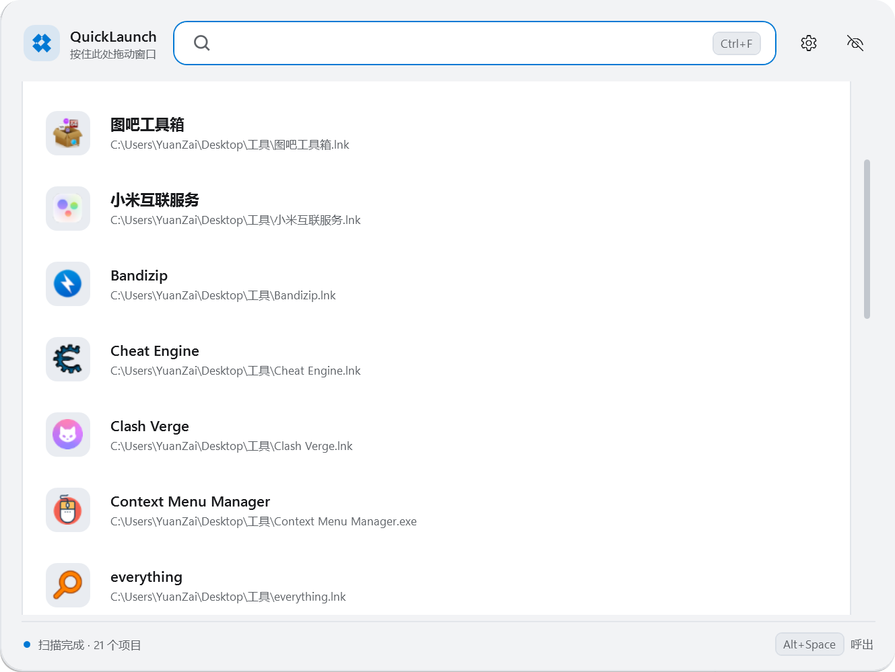
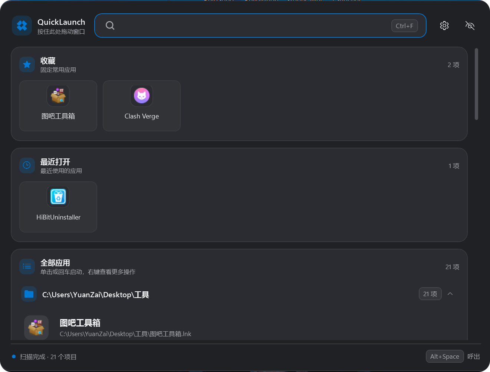

# QuickLaunch

Windows 11 风格的自定义快速启动面板，用于替代开始菜单和桌面快捷方式。

支持全局快捷键呼出、快速搜索、拼音搜索、收藏、最近使用、应用分组、管理员运行、主题切换等功能。

## 截图

| 主界面                              | 设置                                 |
| -------------------------------- | ---------------------------------- |
|    |    |
|  |  |

## 功能

### 🚀 快速启动

* `Alt + Space` 全局快捷键呼出面板，可在设置中修改
* 单击应用直接启动
* 输入关键词后按 `Enter` 启动当前结果
* `Esc` 或点击面板外部收起
* 支持“以管理员身份运行”

### 🔍 智能搜索

支持：

* 应用名称
* 完整路径
* 拼音
* 拼音首字母

例如输入 `wxz` 可以搜索到“外星仔加速器”。

搜索结果会根据匹配度自动排序；没有搜索关键词时，则按照收藏、最近使用、使用次数和手动顺序排列。

### 📁 应用分组

根据应用所在文件夹自动分组。

将一个应用拖到另一个应用上，可以创建分组并调整组内顺序，不会移动磁盘上的实际文件。

### ⭐ 收藏与最近使用

* 收藏项目固定显示在顶部
* 启动过的应用自动加入“最近打开”
* 收藏和最近使用项目均支持右键操作
* 最近使用中的项目可以单独移除

### 🖱️ 右键菜单

一次右键即可打开菜单，支持：

* 启动
* 以管理员身份运行
* 添加 / 取消收藏
* 从最近打开中移除
* 打开所在文件夹
* 复制完整路径
* 重命名
* 在列表中隐藏

### 🎨 界面与交互

* 浅色 / 深色 / 跟随系统
* 强调色自动跟随 Windows 个性化设置
* 悬停显示反馈，不保留永久选中状态
* 键盘导航时显示当前项高亮
* 鼠标移动后自动切换回悬停效果
* 无效快捷方式显示警告提示

### 🖥️ 系统功能

* 系统托盘驻留
* 双击托盘图标快速呼出
* 可关闭托盘驻留
* 支持开机自启
* 开机自启无需管理员权限

## 设置

### 扫描与索引

可以配置：

* 扫描目录
* 是否递归扫描
* 最大扫描深度
* 文件扩展名
* 排除目录
* 全局快捷键

### 外观与行为

* 主题模式
* 开机自启
* 最小化后是否驻留托盘

### 数据与维护

* 清除图标缓存
* 清理失效项目
* 恢复隐藏项目
* 导入 / 导出设置
* 打开数据文件夹
* 退出程序

## 使用

### 环境要求

* Windows 11
* .NET 8

### 构建

在项目目录执行：

```powershell
dotnet restore
dotnet build -c Release
dotnet run -c Release
```

发布目录通常为：

```text
bin\Release\net8.0-windows\win-x64\publish\
```

建议将 `config.json` 与程序 EXE 放在同一目录。

## 数据文件

首次运行后会自动生成：

```text
favorites.json
recent.json
catalog.cache.json
cache/
└─ icons/
   └─ *.png

logs/
└─ quicklaunch.log
```

这些文件用于保存收藏、最近使用记录、程序索引、图标缓存和运行日志。

## AI 使用说明

本项目部分代码、功能设计及文档内容由 AI 辅助生成，并经过作者修改、测试和整理。


## 项目结构

```text
QuickLaunch/
├─ Assets/
│  ├─ QuickLaunch.ico
│  ├─ QuickLaunch.png
│  └─ default-icon.png
├─ Helpers/
│  ├─ AppDialog.cs
│  ├─ FuzzyMatcher.cs
│  ├─ NativeMethods.cs
│  ├─ PinyinSearchService.cs
│  ├─ SimpleInputDialog.cs
│  ├─ UiAnimations.cs
│  └─ WindowDragHelper.cs
├─ Models/
│  ├─ AppConfig.cs
│  ├─ AppEntry.cs
│  └─ AppGroup.cs
├─ Services/
│  ├─ ConfigService.cs
│  ├─ FileWatcherService.cs
│  ├─ HotkeyService.cs
│  ├─ IconCacheService.cs
│  ├─ LaunchService.cs
│  ├─ LogService.cs
│  ├─ PersistenceService.cs
│  ├─ ScannerService.cs
│  ├─ SingleInstanceService.cs
│  ├─ StartupService.cs
│  └─ ThemeService.cs
├─ Themes/
│  ├─ Controls.xaml
│  └─ Tokens.xaml
├─ ViewModels/
│  ├─ MainViewModel.cs
│  ├─ SettingsViewModel.cs
│  └─ ViewModelBase.cs
├─ App.xaml
├─ App.xaml.cs
├─ C
```
